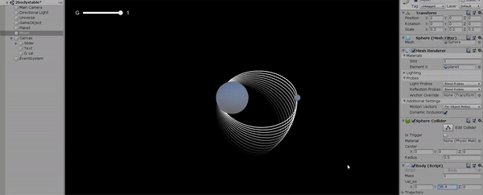
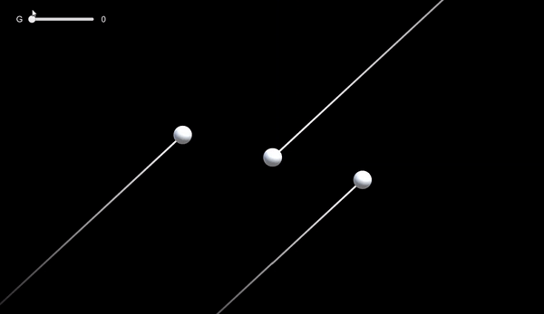

# Multibody-Orbital-Mechanics
Simulation playground of multibody orbital mechanics using ODE

## Examples:

## Planet and Moon

## 3 Body stable orbit
Ref: https://en.wikipedia.org/wiki/Three-body_problem

Solution to a stable equal mass 3 body problem

